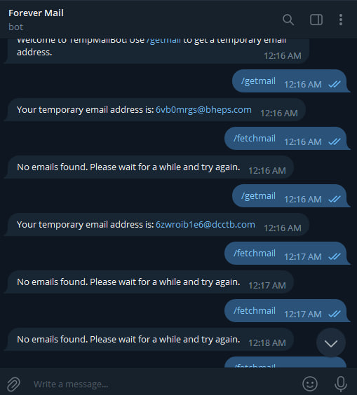

# Forever Temporary Mail Bot

[](https://github.com/WASCIV/Forevermail/blob/main/LICENSE)
[](https://github.com/WASCIV/Forevermail/stargazers)

Temporary Mail Bot is a Telegram bot that allows you to create temporary emails and receive emails in them. This bot is useful when you need to register for online services and don't want to give out your personal email address.

## How to use the this Telegram Bot in Windows?

1. First of create a Bot from @Botfather and I Assume you have an Account on Telegram

2. Name it and give it username as it asks

3. It will give you a Bot Token (Something like this 1334385210:AAEn-8Jeb_vcyE5ww2RFfj78K4diZ7UlEFE

4. Make sure to install pip

## HOW TO INSTALL PIP

o install pip on Windows, follow these steps:

    Download the get-pip.py file from the official Python website: https://bootstrap.pypa.io/get-pip.py

    Open a command prompt by pressing the Windows key and typing "cmd", then clicking on the "Command Prompt" app.

    Navigate to the directory where you saved the get-pip.py file using the cd command. For example, if you saved the file to your Downloads folder, type:

    bash

``` cd Downloads ```

Run the following command to install pip:

``` python get-pip.py ```

If you have multiple versions of Python installed on your system, you may need to specify the version of Python you want to use.

 ```python3 get-pip.py ```

After pip is installed, you can use it to install Python packages by typing pip install <package-name> in the command prompt. For example:

   ``` pip install requests ```

That's it!

## Coming Back to Installation On Windows

5. Copy the Bot Token and Paste it 

```python
_G = '1334385210:AAEn-8Jeb_vcyE5ww2RFfj78K4diZ7UlEFE' Instead of 'YOUR_BOT_TOKEN' You should paste your own..

```

5. Make sure to run ``` pip install -r requirements.txt ```

6. Keep the terminal running as it should so the bot remains running.

7. You can also host them on Railway or Heroku... But don't do it on firebase

8. But if you want to use for personal use you can just run the script on your PC..

9. Finally run ``` python tempmail.py ```

## How to Install on Linux

How to use the Telegram Bot on Linux?

    First of all, create a Bot from @Botfather and I assume you have an account on Telegram.

    Name it and give it a username as it asks.

    It will give you a Bot Token (Something like this 1334385210:AAEn-8Jeb_vcyE5ww2RFfj78K4diZ7UlEFE)

    Make sure to install pip.

## HOW TO INSTALL PIP

To install pip on Linux, you can use your system's package manager. Here's how to do it on some popular Linux distributions:
Ubuntu and Debian

bash

sudo apt-get update
sudo apt-get install python3-pip

CentOS and Fedora

bash

sudo yum update
sudo yum install python3-pip

Arch Linux

bash

sudo pacman -Sy python-pip

After pip is installed, you can use it to install Python packages by typing pip install <package-name> in the terminal. For example:

bash

pip install requests

That's it!
## Coming back to installation on Linux

    Copy the Bot Token and paste it

python

_G = '1334385210:AAEn-8Jeb_vcyE5ww2RFfj78K4diZ7UlEFE' Instead of 'YOUR_BOT_TOKEN' You should paste your own..

    Make sure to run pip install -r requirements.txt.

    Keep the terminal running so the bot remains running.

    You can also host them on Railway or Heroku... But don't do it on Firebase.

    If you want to use it for personal use, you can just run the script on your PC.

    Finally, run python tempmail.py.

``` Usage: /getmail- To get a new email address
           /fetchmail- To fetch mails from the address
           /start- It will welcome you 
```

## Video Tutorial On How to Use ?

https://youtu.be/HqSVxZ-SGzo


## Screenshots




## Contributions

Contributions are welcome! If you find a bug or have a feature request, please open an issue on GitHub.

## License

This project is licensed under the [MIT License](https://github.com/WASCIV/Forevermail/blob/main/LICENSE).

## Follow me on Instagram

Don't forget to follow me on Instagram [@wasiqhatesinsta](https://www.instagram.com/wasiqhatesinsta/) for more projects and updates!
